Welcome to Heartpace Assignment
=============== 
**The app is ready for use by this link: http://44.201.232.63:3000/**

This app was created using React and Redux for the front end and Node.js and Express for the back end.

## Running with Docker

This app can be run using Docker for easier environment setup.

## Prerequisites

- Docker
- Docker Compose

This will build the necessary images for the front-end, back-end, and database.

## Start Containers

Once images are built, start the containers:

```bash
docker compose up -d
```

This will start the front-end, back-end, and database containers.

The app will be available on http://localhost:3000.

The back-end API will be at http://localhost:3001.

## Stop Containers

To stop the containers, run:

```bash
docker compose down
```

This will stop and remove the containers.

Let me know if you need any clarification or have additional questions!

## Build Images

Build the Docker images:

```bash
docker compose build
```


## Running without Docker

Navigate to each directory (front-end & server) of the project and run the following commands:

```bash
npm run dev
# or
yarn dev
# or
pnpm dev
```

This will start the front-end, back-end.


# Usage

Heartpase app - is consist of such functionality:

- ### Add User to the table
  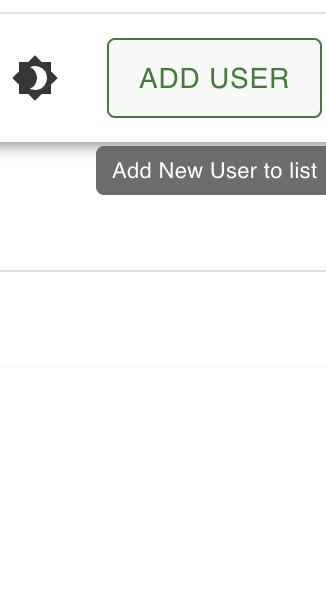
  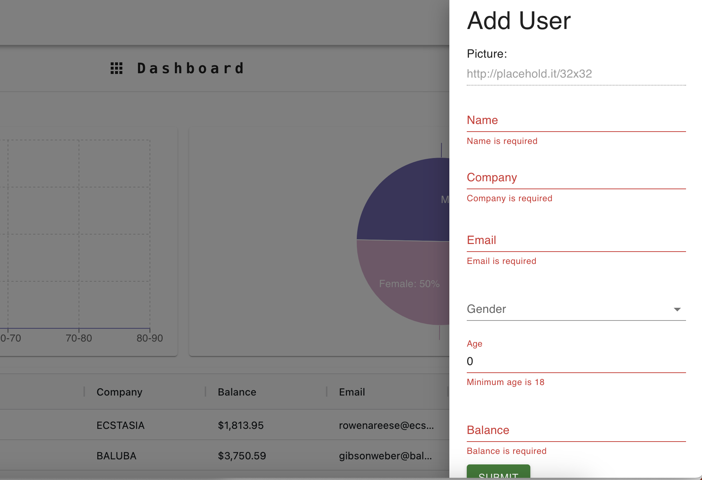

- ### Edit user info in the table
  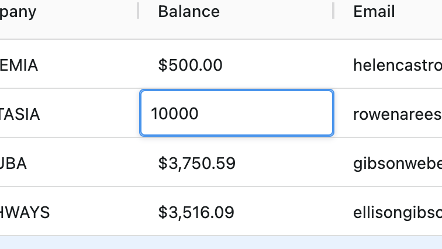

- ### Delete user from the table
  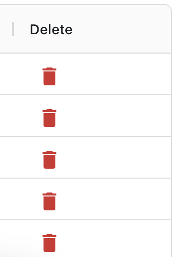

- ### See the list of all 1,000 + users in a paginated table
  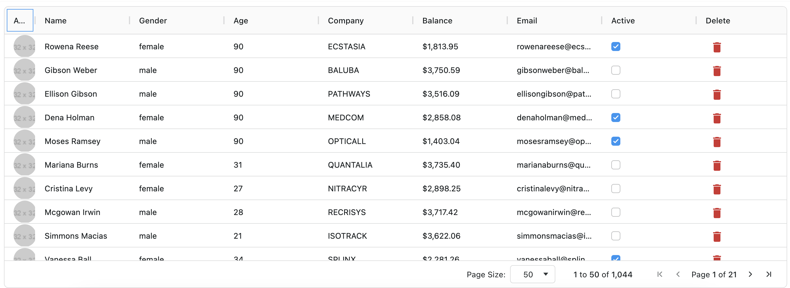

- ### Two ways sorting for table data
  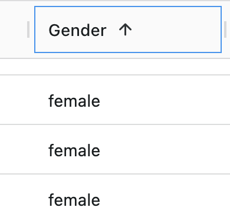

- ### Searching data by column values
  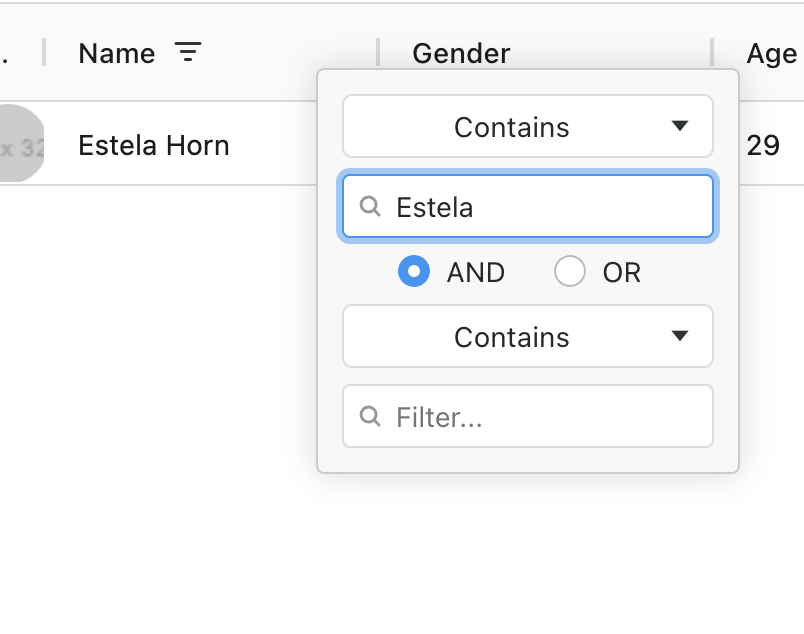

- ### See two graphs:
- - ### Correlation between users age and avarage budget; 
    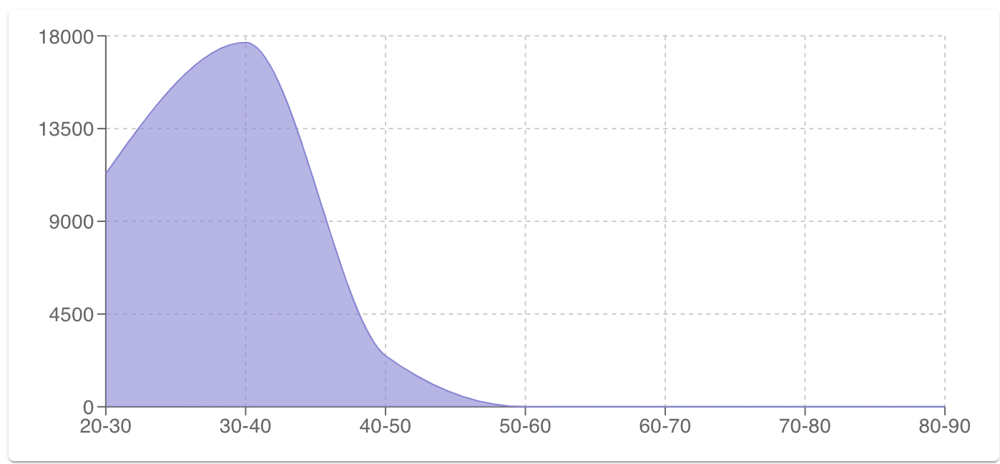
- - ### Correlation in percentage between male and female budget amount.
    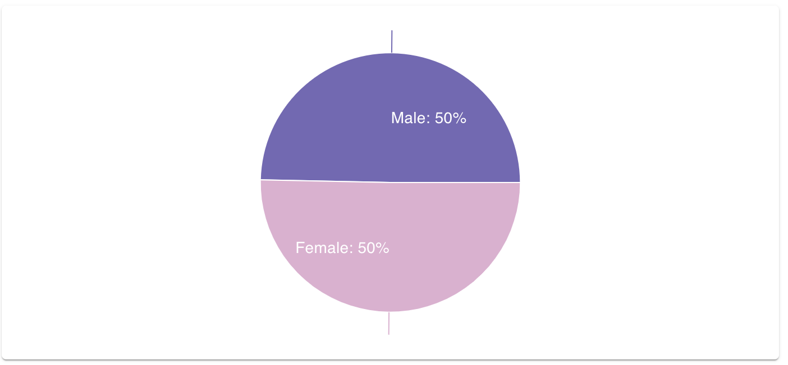

- ### Application is responsible and useful on mobile devices.
  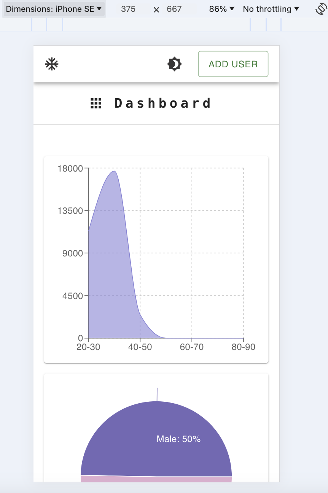
- ### Application supports Dark and Light mode.
  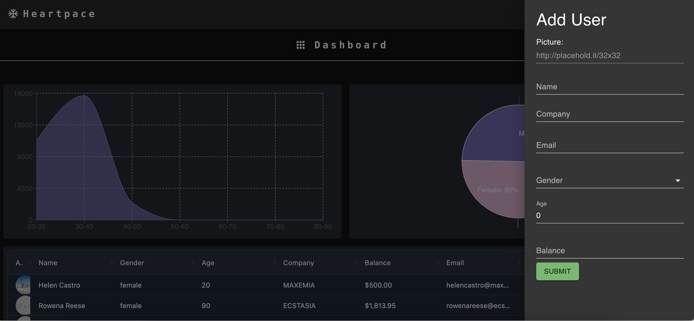


# Thank you for your time and consideration!
